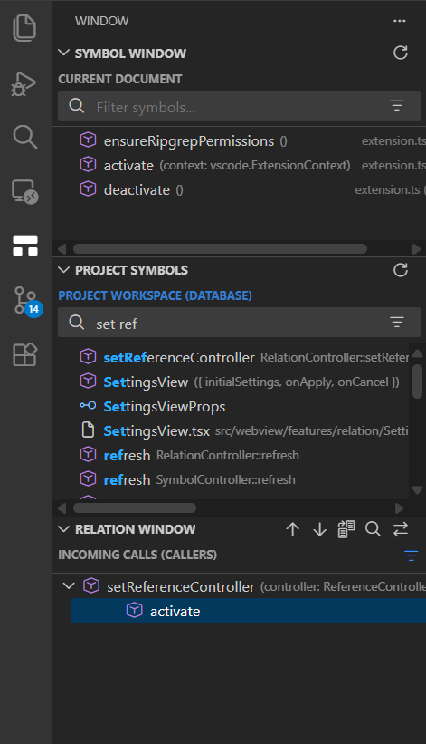
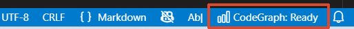
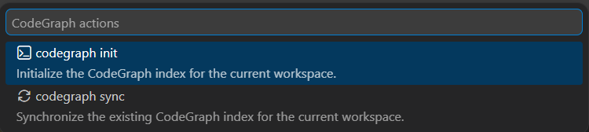

# CodeGraph Relation

CodeGraph Relation is a VS Code extension for exploring project symbols, call relations, and references from an existing [CodeGraph](https://colbymchenry.github.io/codegraph/) index.

It is intentionally focused on daily code navigation:

- search project symbols with CodeGraph-powered fuzzy, approximate, and pronunciation-close terms
- inspect the current file outline without leaving the editor
- open callers, callees, and references from the side bar
- keep index ownership explicit through `codegraph init` and `codegraph sync`



## Requirements

Install the `codegraph` CLI first. The extension does not bundle CodeGraph and does not create a graph automatically.

No Node.js is required for the installer scripts:

```bash
# macOS / Linux
curl -fsSL https://raw.githubusercontent.com/colbymchenry/codegraph/main/install.sh | sh
```

```powershell
# Windows PowerShell
irm https://raw.githubusercontent.com/colbymchenry/codegraph/main/install.ps1 | iex
```

If you already have Node.js, npm works too:

```powershell
npm i -g @colbymchenry/codegraph
```

Verify the CLI is available:

```powershell
codegraph --version
```

In each workspace, initialize CodeGraph manually from the workspace root:

```powershell
codegraph init
codegraph status
```

You can also click the status bar item and choose **codegraph init** from the **CodeGraph actions** list.

After `.codegraph/` exists at the workspace root, the extension uses CodeGraph directly. If the graph is missing, the views show an unavailable state instead of falling back to LSP indexing.

## Quick Start

1. Open a workspace in VS Code.
2. Run `codegraph init` in the workspace root, or click the status bar item and choose **codegraph init**.
3. Open the **Window** activity bar container.
4. Use **Symbol Window** for the active file outline.
5. Use **Project Symbols** or `Ctrl+T` for workspace search.
6. Use **Relation Window** or `Shift+Alt+H` to inspect callers and callees for the current symbol.
7. Use `Shift+Alt+F12` to open references.

The status bar shows whether the active workspace is connected to CodeGraph.



Click the status item to run CodeGraph actions from VS Code. Use **codegraph init** to create the index, and use **codegraph sync** after source files change so the graph stays current.



## Symbol Search

Project search is backed by `codegraph query`, so it is not limited to exact text matching. You can search with partial names, fuzzy terms, or words that are close to the spelling or pronunciation you remember. CodeGraph ranks results by relevance and the extension keeps exact matches first when possible.

Examples:

- `main` finds entry-point related symbols.
- `set ref` can find symbols such as `setReferenceController`.
- incomplete or approximate names can still surface related functions when CodeGraph ranks them as relevant.

When the Project Symbols search box is empty, the extension shows a useful default set from indexed `main.*` files when available. If no main file exists, it shows symbols from the first indexed files so the view is not blank.

Current Document search filters the active file locally and expands matching parents, which makes it useful for jumping inside large files.

## Relation Window

Relation Window uses CodeGraph relation queries:

- **Incoming Calls**: `codegraph callers`
- **Outgoing Calls**: `codegraph callees`
- **Both Directions**: optional split view for callers and callees together
- **Jump to Definition**: navigate from relation results to the related symbol
- **Lookup References**: open the Reference Window for the current symbol

Enable `relationWindow.autoSearch` if you want the relation tree to follow cursor movement. Leave it disabled for manual, stable inspection with `Shift+Alt+H`.

## Reference Window

Reference lookup opens a dedicated webview panel. It is explicit rather than cursor-driven, so it does not constantly replace your current review context.

Use it from:

- the Relation Window toolbar
- the editor context menu
- `Shift+Alt+F12`

Optional ripgrep fallback is controlled by `shared.enableRipgrepFallback` and is disabled by default because CodeGraph is the primary source.

## CodeGraph Behavior

CodeGraph gives the extension a prebuilt symbol graph instead of asking VS Code language servers to rediscover the project repeatedly. In practice this means:

- workspace search is graph-backed and relevance-ranked
- relation lookups use CodeGraph caller/callee data
- current-file symbols come from `codegraph node --symbols-only`
- stale results are fixed by running `codegraph sync` or `codegraph init`, either from the CLI or from the status bar **CodeGraph actions** list
- optional automatic sync can run `codegraph sync` after saved, created, deleted, or renamed source files when `.codegraph/` already exists and a CodeGraph Relation side-bar view is visible
- the extension does not create, rebuild, or own the index automatically

Useful CLI commands:

```powershell
codegraph status
codegraph sync
codegraph init
```

## Settings

| Setting | Default | Description |
| --- | --- | --- |
| `shared.codeGraphPath` | `codegraph` | CodeGraph CLI command name or full path. |
| `shared.enableRipgrepFallback` | `false` | Enables optional text-search fallback. |
| `shared.autoSyncOnSave` | `true` | Runs debounced `codegraph sync` after file changes when `.codegraph/` already exists and a CodeGraph Relation side-bar view is visible. |
| `shared.autoSyncDebounceMs` | `30000` | Delay before automatic sync runs after file changes (250–3,600,000 ms). |
| `symbolWindow.enable` | `true` | Enables Symbol Window. |
| `symbolWindow.splitView` | `false` | Splits Current Document and Project Symbols into separate views. |
| `symbolWindow.enableHighlighting` | `true` | Highlights query terms in symbol results. |
| `symbolWindow.symbolParsing.mode` | `auto` | Controls symbol display cleanup. |
| `relationWindow.enable` | `true` | Enables Relation Window. |
| `relationWindow.autoSearch` | `false` | Updates relations on cursor movement. |
| `relationWindow.showBothDirections` | `false` | Shows callers and callees together. |
| `relationWindow.autoExpandBothDirections` | `false` | Expands both relation groups automatically. |
| `referenceWindow.enable` | `true` | Enables Reference Window. |

## Commands

| Command | Keybinding | Purpose |
| --- | --- | --- |
| `Symbol Window: Focus Project Window Search` | `Ctrl+T` | Search workspace symbols. |
| `Symbol Window: Focus Current Window Search` | `Ctrl+Shift+O` | Filter current-file symbols. |
| `Relation Window: Search` | `Shift+Alt+H` | Load relations for the current symbol. |
| `Relation Window: Lookup References` | `Shift+Alt+F12` | Open references for the current symbol. |
| `Reference Window: Previous Reference` | `F1` | Move to previous reference result. |
| `Reference Window: Next Reference` | `F2` | Move to next reference result. |

## Troubleshooting

- **CodeGraph: Missing**: run `codegraph init` in the workspace root, or click the status bar item and choose **codegraph init**.
- **Stale results after source updates**: run `codegraph sync`, or click the status bar item and choose **codegraph sync**. Run `codegraph init` again for a full rebuild.
- **CLI not found**: add CodeGraph to `PATH` or set `shared.codeGraphPath`.
- **No references from text fallback**: enable `shared.enableRipgrepFallback` if you need ripgrep-based text matches.

## Development

```powershell
npm ci
npm run check-types
npm run lint
npm run compile
```

On this project, the preferred verification loop is:

```powershell
npm run check-types
npm run lint
npm run compile
```
